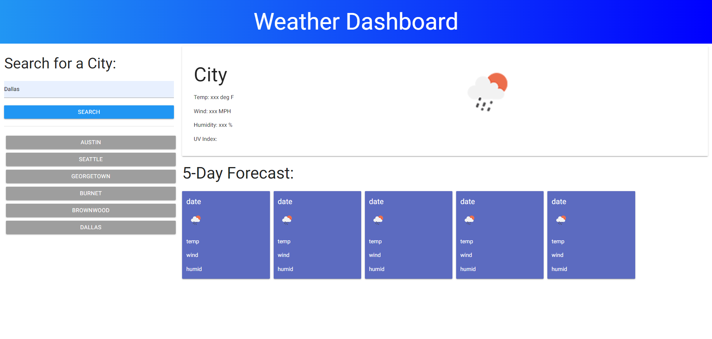
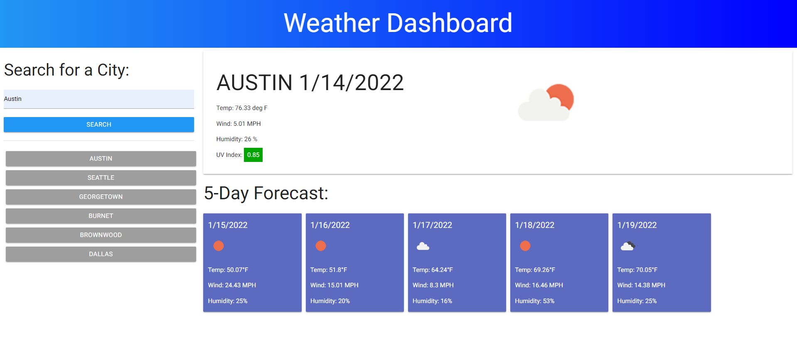

# 06 Server Side APIs: Weather Dashboard
[Link to the live page](https://clabel95.github.io/06-Server-Side-APIs-Homework/)


[Link to the github repository](https://github.com/clabel95/06-Server-Side-APIs-Homework)

## My task

Create a simple weather application that allows a user to input a city and have the page propogate with the corosponding citys weather info as well as a 5 day forcast.


## Features

```md
- City Search Bar
    - After a city is searched the city name will appear below the search bar as an interactable button
    - if more than 6 cities are searched then the oldest search will be removed and replaced by the new search.
    - if a city is searched multiple times it wont show up multiple times under the search bar.
    - if the page is refreshed then the most recent searches will still be avalible as buttons.
- Current weather
    - Shows current weather for the specified city
    - displays an icon representing the current weather
    - displays temp, windspeed, humidity %, and uv index
        - the uv index display will update its background based on if the value is safe or not
        - green indicates that it is a safe uv index
        - yellow indicates a moderate uv index
        - red indicates a high uv index
- 5-Day forcast
    - displays the date for the next 5 days
    - icon below the date displays the average daily forcast
    - average temp for the day is displayed below that
    - average windspeed is displayed below that
    - average humidity is displayed below that    

```
The following image shows the final page being refreshed. This image shows that the page has persisting data from previous searches.





The following image shows the final page with the search data for Austin as well as the previous searches to the side of the page.

